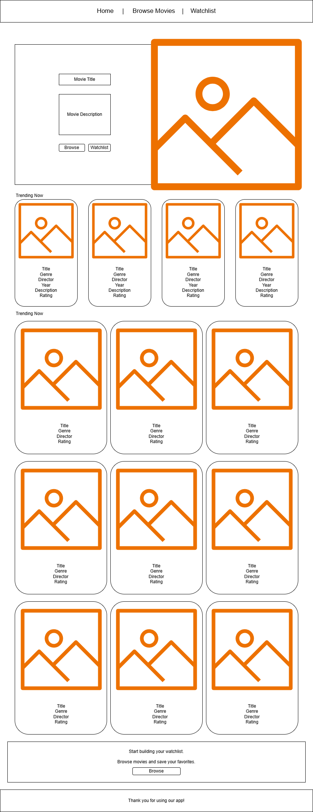
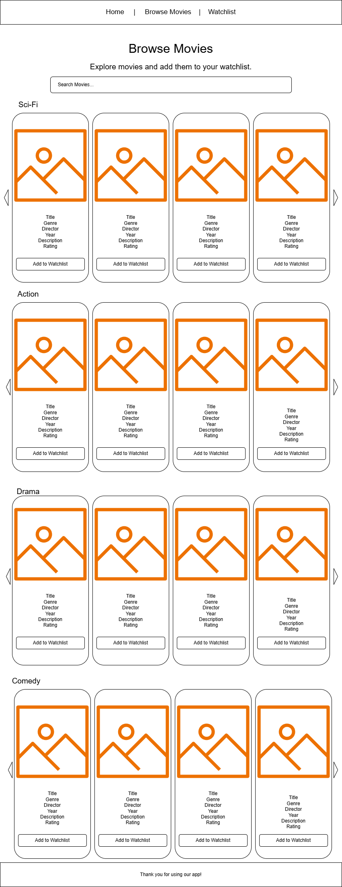
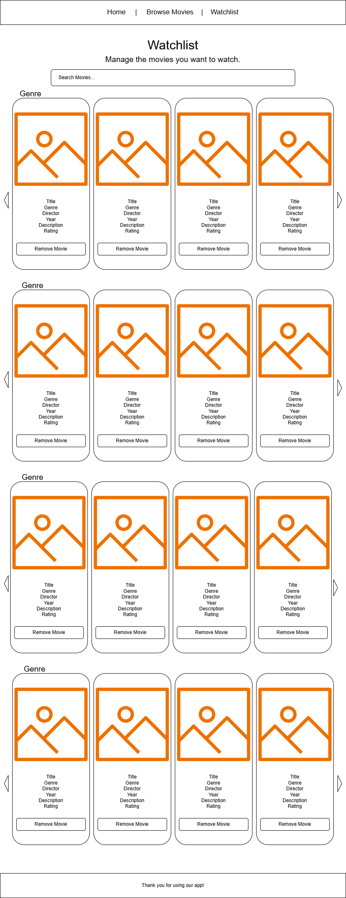

<h2>React Application</h2>

Built by Adam Ellison.

  I wanted to create something that felt familiar and intuitive, where users can browse movies by genre and build a personal
  watchlist. A big focus was improving the user experience with features like horizontal
  carousels, search with autocomplete, and instant UI updates when adding or removing movies.

<h1>WatchVerse App</h1>

  This React application that allows the project to use a seperate
  <strong>json-server</strong> backend and follows a client/server folder structure.

<h2>Project Overview</h2>

  This project demonstrates how a React frontend connects to an API using
  <code>fetch()</code>. The frontend was built with React and Vite, while the backend
  was created with <code>json-server</code>.

Users can:

<ul>
  <li>Browse movies by genre in carousel rows</li>
  <li>Search movies with autocomplete suggestions</li>
  <li>Add movies to a watchlist</li>
  <li>Prevent duplicate watchlist entries</li>
  <li>View and search their watchlist</li>
  <li>Remove movies from the watchlist</li>
</ul>

<h2>Tech Stack</h2>

<ul>
  <li><strong>Frontend:</strong> React, Vite, React Router</li>
  <li><strong>Backend:</strong> json-server</li>
  <li><strong>Styling:</strong> CSS</li>
  <li><strong>Version Control:</strong> Git and GitHub</li>
  <li><strong>Deployment:</strong> Vercel (frontend), Render (backend)</li>
</ul>

<h2>Project Structure</h2>

<pre><code>project03/
  client/
    src/
      components/
      pages/
      services/
    .env
    package.json
    vite.config.js
  server/
    db.json
    package.json
    server.js
/.gitingore
</code></pre>

<h2>Wireframes</h2>

Initial design concepts for the application layout:

<h3>Home Page</h3>

<h3>Movies Page</h3>

<h3>Watchlist Page</h3>

<h2>Features</h2>

<ul>
  <li>React Router with 3 main pages</li>
  <li>GET requests to load movies and watchlist data</li>
  <li>POST requests to add movies to the watchlist</li>
  <li>DELETE requests to remove movies from the watchlist</li>
  <li>Shared watchlist state managed in <code>App.jsx</code></li>
  <li>Local component state for search, loading, and UI feedback</li>
  <li>Autocomplete search suggestions</li>
  <li>Genre-based movie rows displayed as carousels</li>
  <li>Watchlist grouped by genre and split into carousels</li>
  <li>Reusable React components</li>
  <li>Dynamic hero banner displaying featured movies with rotating content</li>
  <li>Movie posters displayed across all pages using external image URLs</li>
  <li>Clickable UI elements (hero banner and movie cards) for navigation</li>
  <li>Randomized "Recommended for You" section on the home page</li>
  <li>Enhanced UI inspired by streaming platforms with responsive layouts</li>
</ul>

  

  With this application, I focused heavily on user experience, incorporating a dynamic
  home page with a featured movie banner, responsive layouts, and movie cards with poster images.

<h2>Routes</h2>

<ul>
  <li><code>/</code> — Home page</li>
  <li><code>/movies</code> — Browse all movies by genre</li>
  <li><code>/watchlist</code> — View saved watchlist movies</li>
</ul>

<h2>API Endpoints</h2>

<ul>
  <li><code>GET /movies</code> — Retrieve all movies</li>
  <li><code>GET /watchlist</code> — Retrieve watchlist movies</li>
  <li><code>POST /watchlist</code> — Add a movie to the watchlist</li>
  <li><code>DELETE /watchlist/:id</code> — Remove a movie from the watchlist</li>
</ul>

<h2>Environment Variables</h2>

The frontend uses an environment variable for the API base URL.

<pre><code>VITE_API_BASE_URL=http://localhost:3000</code></pre>

This file should be placed inside:

<pre><code>client/.env</code></pre>

<h2>How to Run the Project Locally</h2>

<h3>1. Clone the repository</h3>

<pre><code>git clone YOUR_REPOSITORY_URL
cd project03
</code></pre>

<h3>2. Start the backend</h3>

<pre><code>cd server
npm install
npm start
</code></pre>

The backend runs on:

<pre><code>http://localhost:3000</code></pre>

<h3>3. Start the frontend</h3>

<pre><code>cd client
npm install
npm run dev
</code></pre>

The frontend runs on a Vite development port such as:

<pre><code>http://localhost:5173</code></pre>

<h2>User Stories</h2>

<ul>
  <li>As a user, I want to browse movies by genre so I can find movies I want to watch.</li>
  <li>As a user, I want to add a movie to my watchlist so I can save it for later.</li>
  <li>As a user, I want to search movies and watchlist entries so I can quickly find what I am looking for.</li>
  <li>As a user, I want to be able to remove a movie from the watchlist after watching it.</li>
</ul>

<h2>Wireframes</h2>

This project includes wireframes for the following pages:

<ul>
  <li>Home page</li>
  <li>Movies page</li>
  <li>Watchlist page</li>
</ul>

  Wireframes show layout structure, navigation, API communication,
  and how the user interacts with the application.

<h2>Reusable Components</h2>

<ul>
  <li>Navbar</li>
  <li>Footer</li>
  <li>SearchBar</li>
  <li>MovieList</li>
  <li>MovieCard</li>
  <li>EmptyState</li>
  <li>LoadingMessage</li>
</ul>

<h2>State Management</h2>

This project uses both local state and shared state:

<ul>
  <li><strong>Shared state:</strong> watchlist data managed in <code>App.jsx</code></li>
  <li><strong>Local state:</strong> loading, search terms, selected movie UI messages, and page-specific behavior</li>
</ul>

<h2>Deployment Plan</h2>

<ul>
  <li><strong>Frontend:</strong> Deploy the <code>client</code> folder to Vercel</li>
  <li><strong>Backend:</strong> Deploy the <code>server</code> folder to Render</li>
</ul>

When deployed, the frontend connects to the live backend using an environment variable:

<pre><code>VITE_API_BASE_URL=https://your-render-backend-url.onrender.com</code></pre>

This allows the application to dynamically switch between local and production environments.

<h2>Challenges</h2>

<ul>
  <li>Handling case-sensitive file paths across different environments</li>
  <li>Refactoring the app to use shared global state without breaking existing functionality</li>
  <li>Organizing movie data into genre-based carousels</li>
  <li>Keeping the UI responsive and intuitive while managing multiple features</li>
</ul>

<h2>Future Improvements</h2>

<ul>
  <li>Add update/edit functionality</li>
  <li>Add authentication and user accounts</li>
  <li>Replace json-server with a custom Express/PostgreSQL backend</li>
</ul>

